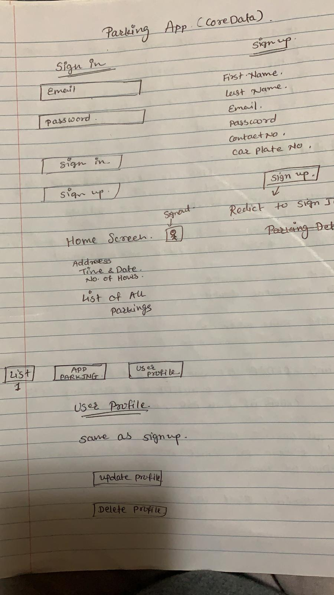
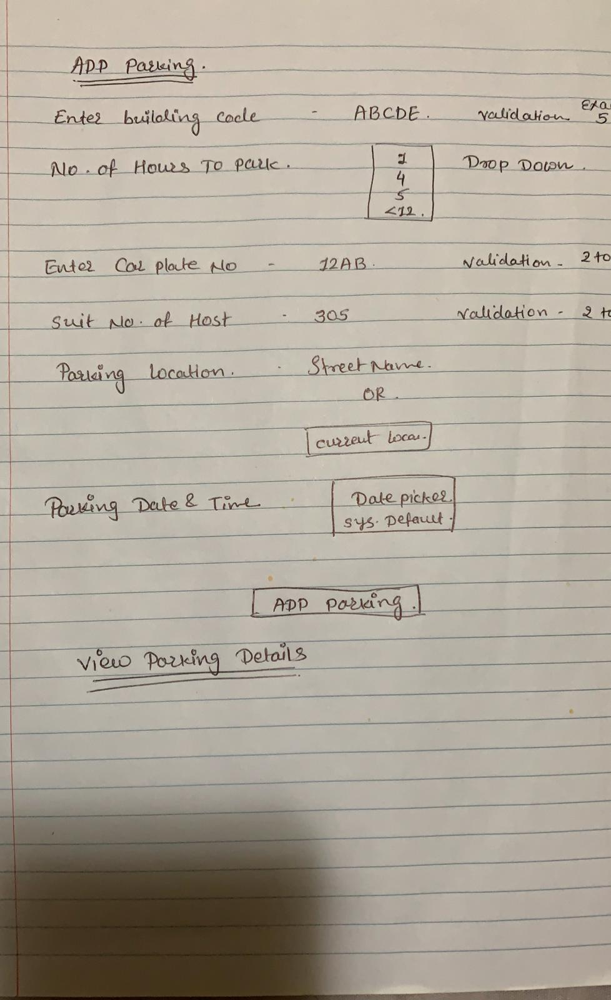

# Parking_App_Maham_Pinal_Group_1
Parking App Group 1

Visit an App Preview - https://user-images.githubusercontent.com/70823359/111871887-ce8bc980-8962-11eb-9ca4-6717f0526adf.mov

### January 14th: Discussion about the project. 
* Zoom meeting discussion about the flow of the app.
* Pinal made the following app flow sketches:

 
### January 15th: Division of tasks.
**Before dividing functionalities:** Make a data model and mvc architecture together, so there is no conflict.

#### LIST OF FUNCTIONALITIES TO BE DIVIDED  
##### User Profile 
1. Sign-up page 
2. Sign-in page 
3. Home-page(View parking -> see below) + Sign-out button
4. update profile Screen (add delete account facility on this page)
5. Account entity + user entity record: 
    * Name attribute
    * Email attribute
    * Password attribute
    * contact number attribute
    * car plate number attribute
    * Profile picture (bonus feature)

##### Add Parking 
1. “Add Parking” form 
2. Create a new Parking record/entity with the following information:
    * Building code (exactly 5 alphanumeric) 
    * No. of hours intended to park (1-hour or less, 4-hour, 12-hour, 24-hour) 
    * Car Plate Number (min 2, max 8 alphanumeric) 
    * Suit no. of host (min 2, max 5 alphanumeric) 
    * Parking location (street address, lat and lng) 
    * date and time of parking (use system date)
3. User can input the parking location with street name [obtain location coordinates using geocoding] 
4. User can input the parking location with current location [ use reverse geocoding to obtain street address ]
5. Accept and verifying all information when user adds parking
6. Save parking record to the database when use adds parking ( in CoreData) 
7. When adding the parking information in the database, make sure that you associate the record with the currently logged in user. 
8. Appropriately design the relationship between the user and parking entities. 

##### View Parking 
1. list of all the parking they have made (most recent parking first)
2. detail view of each parking when the user taps on any item of the list, display all the information about the parking in appropriate format. 
3. In the detail view of parking, allow the user to open the parking location on map and display the route to the parking location from the current location of the device. 

